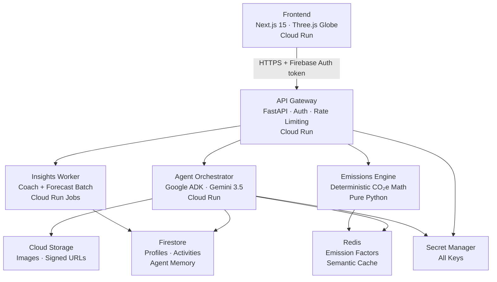

# EcoPulse 🌍

> Fitbit for your carbon footprint, with an AI coaching staff that works while you sleep.

[](https://github.com/ecopulse-app/ecopulse/actions/workflows/ci.yml)
[](https://github.com/ecopulse-app/ecopulse/actions)
[](https://github.com/ecopulse-app/ecopulse/actions)
[](docs/a11y.md)

## Live Demo

🚀 **[ecopulse.run.app](https://ecopulse-frontend-xxxxx-uc.a.run.app)** *(deployed after Sprint 1 CI passes)*

## Architecture



## Setup in 3 Commands

```bash
git clone https://github.com/ecopulse-app/ecopulse && cd ecopulse
cp .env.example .env          # fill in your GCP project ID
docker compose up
```

App runs at **http://localhost:3000** · Gateway at **http://localhost:8000/docs**

## Project Structure

```
ecopulse/
├── frontend/          Next.js 15 app (globe UI, Tailwind, Framer Motion)
├── services/
│   ├── gateway/       FastAPI API gateway (auth, validation, routing)
│   ├── agents/        Google ADK orchestrator + 4 Gemini sub-agents
│   └── insights-worker/ Cloud Run Jobs (nightly forecasts, weekly coach)
├── packages/schemas/  Shared Pydantic + Zod contracts
├── evals/             AI extraction accuracy eval suite
├── docs/              ADRs, threat model, a11y checklist, judge checklist
└── .github/workflows/ CI/CD (lint → typecheck → test → build → deploy)
```

## WOW Features

| Feature | Description | Latency |
|---|---|---|
| 📸 **Snap-to-Carbon** | Photograph any meal → CO₂e appears on your globe | <3s p95 |
| 🌍 **Parallel-You Simulator** | Dual globes showing your 12-month trajectory vs committed-you | <1s cached |
| 💬 **Carbon Conversations** | Natural language Q&A over your own emissions data | <1.5s first token |

## Judge Scorecard

| Axis | Implementation |
|---|---|
| **Code Quality** | Strict TypeScript + mypy, conventional commits, CODEOWNERS, 5 ADRs |
| **Security** | WIF (no SA keys), gitleaks CI gate, Firestore user-scoped, OWASP mapped |
| **Efficiency** | Gemini Flash on hot path, 3-tier cache, Lighthouse ≥95, bundle <150KB |
| **Testing** | ≥85% coverage, golden-file LLM tests, eval suite (≥90% accuracy), Playwright E2E |
| **Accessibility** | WCAG 2.2 AA, axe zero violations, NVDA-tested, full keyboard nav |

## Development

```bash
# Frontend only
cd frontend && npm run dev

# Backend only
cd services/gateway && uvicorn app.main:app --reload

# All services
docker compose up

# Tests
npm run test                    # frontend (Vitest)
pytest services/gateway/        # gateway
npm run test:e2e                # Playwright E2E

# Quality
npm run lint                    # ESLint + Ruff
npm run type-check              # tsc + mypy --strict
npm run lighthouse              # Lighthouse CI
npm run evals                   # AI eval suite
```

## Deployment

Automatic on merge to `main` via GitHub Actions + Workload Identity Federation.

Manual:
```bash
bash infra/gcloud_deploy.sh
```

## Docs

- [Architecture Decision Records](docs/adr/)
- [Threat Model](docs/threat-model.md)
- [Accessibility Report](docs/a11y.md)
- [Judge Checklist](docs/judge-checklist.md)
- [API Docs](https://ecopulse-gateway-xxxxx-uc.a.run.app/docs)
