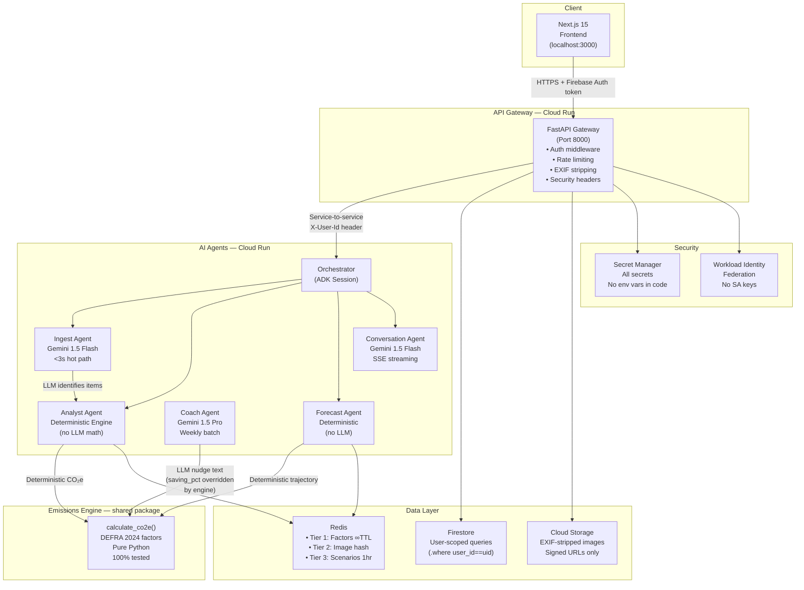

# EcoPulse Architecture

## System Overview



## Agent Routing

| Agent | Model | Path | Latency target |
|---|---|---|---|
| Ingest | Gemini 1.5 Flash | Hot (user-facing) | <3s p95 |
| Analyst | None (deterministic) | Hot (user-facing) | <100ms |
| Forecast | None (deterministic) | Hot (user-facing) | <1s (cached) |
| Conversation | Gemini 1.5 Flash | Hot (streaming SSE) | <1.5s first token |
| Coach | Gemini 1.5 Pro | Batch (weekly cron) | Quality > speed |

## Three Cache Tiers

```
Tier 1: Redis — Emission Factors
  Key: ef:v2024:<version>
  TTL: ∞ (only evict on DEFRA version bump)
  Size: ~50KB

Tier 2: Redis — Semantic Image Cache
  Key: img:<sha256(image_bytes)[:16]>
  TTL: 30 days
  Benefit: Repeated demo photos return instantly, 0 Gemini tokens

Tier 3: Redis — Forecast Scenarios
  Key: fc:<hash(user_id + sorted_interventions)[:16]>
  TTL: 1 hour
  Benefit: <1s for scenario re-simulation after first call
```

## Security Architecture

```
User Request
    │
    ▼
Firebase Auth Token Verification (gateway/auth.py)
    │
    ▼
Rate Limit Check (60 req/min per user)
    │
    ▼
Image Upload? → EXIF Strip → Type/Size Validation
    │
    ▼
Firestore Query → ALWAYS .where("user_id", "==", uid)
    │
    ▼
LLM Call → User content in <user_content> delimiters
    │
    ▼
Output → Pydantic validation → fail closed if invalid
    │
    ▼
Numeric claims → re-validated against Emissions Engine
```

## Key Architecture Decision Records

| ADR | Decision |
|---|---|
| [ADR-001](adr/001-005.md#adr-001) | Emissions Engine separated from LLM agents |
| [ADR-002](adr/001-005.md#adr-002) | Gemini Flash on hot path, Pro on batch only |
| [ADR-003](adr/001-005.md#adr-003) | Firestore with mandatory user_id scoping |
| [ADR-004](adr/001-005.md#adr-004) | npm workspaces + shared Python packages monorepo |
| [ADR-005](adr/001-005.md#adr-005) | Workload Identity Federation — zero SA keys |
